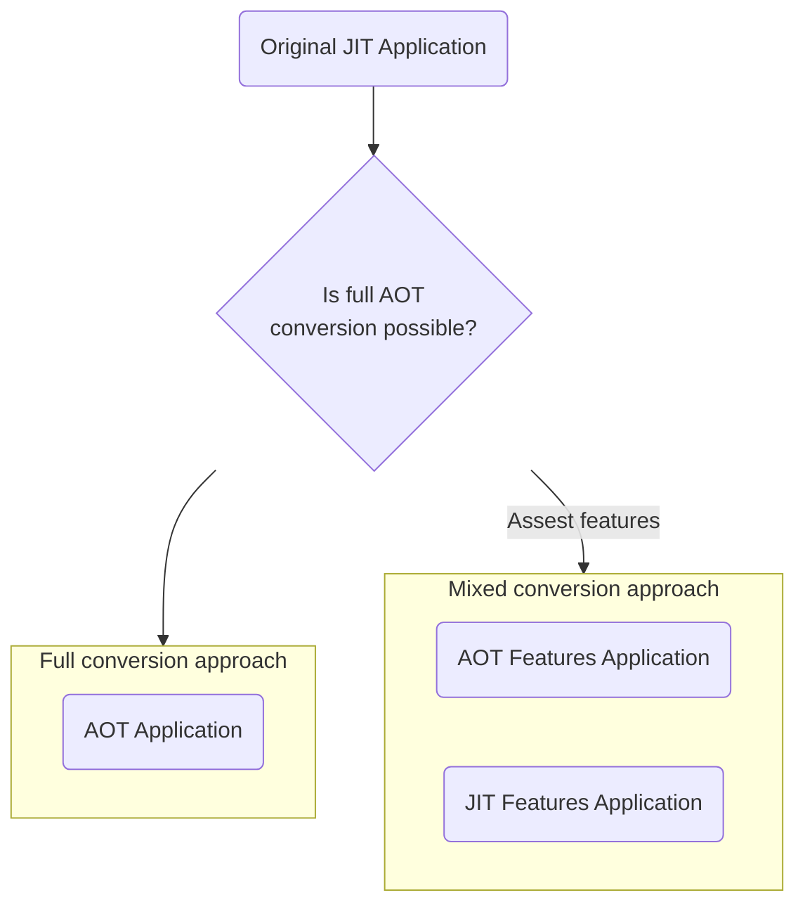

# AOT migration approach

<v-clicks depth="1">

1. Full approach - when all the features can be easily configured to be included in a native build
2. Mixed approach - when not all features can be converted to AOT for any reason, for instance :
   - costs - we need to rewrite the feature and we decide conversion is not worth
   - technical limitation - some feature simply relies on some technology which cannot be converted (i.e. a very old library)

</v-clicks>

<!--
You can have `style` tag in markdown to override the style for the current page.
Learn more: https://sli.dev/features/slide-scope-style
-->