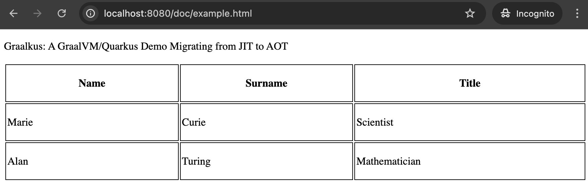

# Running the application

<table>
  <tr>
    <td style="width: 50%">
<v-clicks depth="1">

1. Build the project :

**mvn install-D**

2. Run the native executable

**./target/graalkus-*-runner**

3. Open test url :

http://localhost:8080/doc/example.html

</v-clicks>
    </td>
    <td style="width: 50%">
      
    </td>
  </tr>
</table>
