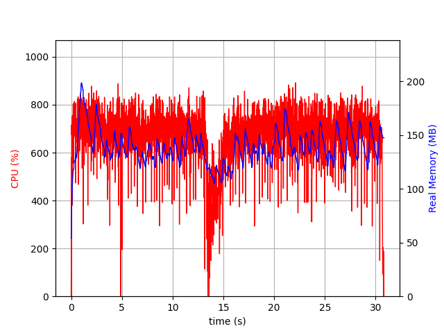

# Benchmark PGO AOT

<table>
  <tr>
    <td style="width: 50%; font-size: 10px">

1. Run some load on the AOT PGO application

**./src/main/script/bench-graph-siege.sh -m AOT**

2. Check the load result : 

<pre>
{
  "transactions": 333324,
  "availability": 100,
  "elapsed_time": 25.92,
  "data_transferred": 404.11,
  "response_time": 0,
  "transaction_rate": 12859.72,
  "throughput": 15.59,
  "concurrency": 11.33,
  "successful_transactions": 333324,
  "failed_transactions": 0,
  "longest_transaction": 0.05,
  "shortest_transaction": 0
}
</pre>

 
 
    </td>
    <td style="width: 50%; font-size: 10px">
      
        
Figure: Resources plotting for AOT PGO application

    </td>
  </tr>
</table>

<!--
You can have `style` tag in markdown to override the style for the current page.
Learn more: https://sli.dev/features/slide-scope-style
-->